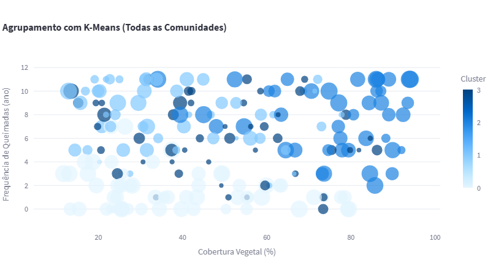

# 🌱 Projeto Avaliativo I²A² – Grupo 88
## Análise Ambiental com Inteligência Artificial

ACESSE https://grupo88.streamlit.app/
---

## 👥 Integrantes do Grupo
- João Paulo da Silva Cardoso – jpscardoso@ufpa.br
- Lucas Maia – celular: +55 91 98063-5989
- Adrianny Lima – celular: adrianny.lima3@gmail.com
- Denis de Castro Silva – denisdecastrosilva@gmail.com
- Renato Moraes da Silva – celular: +55 91 99318-1086
- Arthur Melo – celular: +55 91 98325-2564
---

## 📊 Hipótese sobre o Problema Ambiental
> **"Comunidades com menor cobertura vegetal parecem ter maior frequência de queimadas, independentemente do nível de renda ou acesso à água potável."**

Essa hipótese foi levantada após análise exploratória do dataset com dados de 200 comunidades no estado do Pará. Observamos que comunidades com menos de **20% de cobertura vegetal** tendem a ter **alta incidência de queimadas**, possivelmente associadas a:

- Pressão antrópica  
- Expansão agrícola  
- Atividades ilegais como extração de madeira e abertura de pastagens  

---

## 🤖 Recomendação de Uso da Inteligência Artificial
Utilizamos técnicas de IA para apoiar a análise crítica dos dados socioambientais, destacando:

### 🔹 Clusterização com K-Means
Agrupamos as comunidades com base nas seguintes variáveis:

- **Cobertura Vegetal (%)**  
- **Frequência de Queimadas (ano)**  
- **Distância de Área Urbana (km)**  
- **Índice de Desmatamento (%)**  

### 🔸 Resultados dos Clusters:

| **Cluster** | **Características**                                         |
|--------------|-------------------------------------------------------------|
| **0**        | Baixa cobertura vegetal e alta frequência de queimadas     |
| **1**        | Alta cobertura vegetal e baixo risco ambiental             |
| **2**        | Média cobertura vegetal e comportamento misto              |
| **3**        | Proximidade urbana e desmatamento moderado                 |

Este agrupamento permite **planejar ações localizadas** de **educação ambiental e monitoramento**.

---

## 📈 Gráfico ou Tabela Extraído(a) do Dataset
### 🔍 Relação entre **Cobertura Vegetal** e **Frequência de Queimadas**

> Este gráfico mostra visualmente a tendência observada:
> - **Comunidades com menor cobertura vegetal têm maior número de queimadas.**  
> - O **tamanho dos pontos representa o índice de desmatamento.**  
> - A **cor representa o risco ambiental (Alto / Médio / Baixo).**

---

## 🧠 Registro Escrito Final
Após análise exploratória do dataset fornecido pela I²A², observamos que comunidades com menor cobertura vegetal tendem a apresentar maior incidência de queimadas, independentemente da renda ou acesso a serviços básicos. Utilizamos técnicas de IA, como clusterização com K-Means, para agrupar comunidades com perfis semelhantes e priorizar intervenções. O dashboard interativo permite filtrar por município e comunidade, comparando seus indicadores com a média local. Além disso, incluímos uma seção dedicada à análise geral das 200 comunidades, com histogramas, boxplots e clusterização, revelando padrões territoriais importantes. Mesmo sem correlações estatísticas fortes, a leitura crítica dos dados ajuda a identificar vulnerabilidades e apoiar decisões com base em evidências locais. A proposta reforça o uso da IA como ferramenta de apoio à análise ambiental, promovendo justiça socioambiental e cidadania consciente.

---
